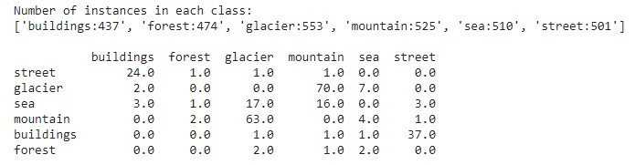

# AkraTech-Challenge_Image Classification ML Model by CNN Architecture by Ajay

## Task Description

 My task is to build a machine-learning model for image classification. The goal is to accurately classify
 images into different categories based on their content. I will work with a provided dataset containing
 around 25,000 images of size 150x150 pixels, distributed across six categories: buildings, forest, glacier,
 mountain, sea, and street.

## Data Description

The dataset consists of approximately 25k images of size 150*150 from a wide range of natural scenes. They are labelled in one of the following 6 categories: buildings, forest, glacier, mountain, sea, street. The “Train”, “Test”, “Validation” and “Prediction” data are separately stored in 'dataset folder'. There are around 14k images in the “Train” set, 3k in the “Test” set and 7k in the “Validation” set and finally 4k in “Predict” set.

Dataset:

Buildings
Forest
Glacier
Mountain
Sea
Street

This dataset is split into three parts:

Training Set  : 14,000 images
Validation Set: 7,000 images
Test Set      : 3,000 images
Predict Set   : 4,0000 images

### Objective

My project classifies images into six categories (buildings, forest, glacier, mountain, sea, and street) using a Convolutional Neural Network (CNN).The task is to create a classifier that identifies which kind of scene the image can be categorized into.

### Overview
I used Python along with libraries like TensorFlow, Keras, and Scikit-learn to develop and train the model.

In this task, we cover the following:

*Preprocessing image data (resizing, normalization, etc.)
*Building the CNN architecture to classify images
*Training the model and optimizing it
*Evaluating performance using accuracy, precision, recall.
*Visualizing model training progress

### Evaluation Metrics

The evaluation metric is accuracy and displayed after evaluation of the model.

### Model Architecture
I used a Convolutional Neural Network (CNN), which is one of the most effective architectures for image classification tasks.

Convolutional Layers : Automatically detect key features in images like edges and textures.
MaxPooling Layers    : Reduce the dimensionality of the features while keeping important information.
Dropout Layers       : Prevent overfitting by randomly disabling some neurons during training.
Dense Layers         : A fully connected network for classification based on extracted features.
Softmax Output Layer : Produces a probability distribution for the six categories.

### Data Preprocessing:
Image preprocessing:

Resizing images to 150x150 pixels.
Rescaling pixel values to the range [0, 1].

Label preprocessing:
Encoding categorical labels to numerical format.

## Installation Setup

Python IDE:
Ensure that Python 3.8+ is installed. If not, download and install it from python.org.
Install an IDE/Code Editor: You can use any Python-compatible IDE.
[VS Code](https://code.visualstudio.com/),
[PyCharm](https://www.jetbrains.com/pycharm/), or
[Jupyter Notebook](https://jupyter.org/install).

I used VS Code Editor and my code is written in Jupyter soruce file.

### Install Libraries:

Open your command promt and install following python libraries:
For TensorFlow:
      
    pip install tensorflow numpy pandas matplotlib scikit-learn opencv-python
      
For PyTorch:
   
    pip install torch torchvision numpy pandas matplotlib scikit-learn opencv-python

### Create a Git repository

Open your command promt and Clone this repository:

git clone https://github.com/your-username/image-classification.git
cd image-classification

### Get the Dataset*

1. *Download the Dataset*: The dataset contains images of buildings, forests, glaciers, mountains, seas, and streets. If you don’t have a dataset, you can use datasets like [Intel Image Classification Dataset](https://www.kaggle.com/datasets/puneet6060/intel-image-classification).
   
2. *Organize the Data*: Typically, the dataset will be organized in folders like this:
    
    dataset/
        train/
            buildings/
            forest/
            glacier/
            mountain/
            sea/
            street/
        valid/
            buildings/
            forest/
            glacier/
            mountain/
            sea/
            street/
        test/
            buildings/
            forest/
            glacier/
            mountain/
            sea/
            street/
        predict/

### Solution Approach

I have set aside 20% of the “Train” set for validation. After quite some experimentation with various augmentation techniques, I concluded that for this dataset, applying a more comprehensive data augmentation does not improve the accuracy of the model. I have resized the images, randomly horizontally flipped them and center-cropped them. 

Alter: I also tried to create a dummy file, downloaded and used some validated images and stored the data in the 'valid set folder' .

Preprocess Technique: 

Use TensorFlow’s ImageDataGenerator or PyTorch’s DataLoader for preprocessing images. I needed to resize and normalize the images before feeding them into the model.
python code:

from tensorflow.keras.preprocessing.image import ImageDataGenerator

train_datagen = ImageDataGenerator(rescale=1./255)
train_generator = train_datagen.flow_from_directory('dataset/train', target_size=(150, 150), batch_size=32, class_mode='categorical')

Train the Model:

python train.py

Evaluate the Model:

python evaluate.py

I did experimentation with various input image sizes (150 pixels or 224 pixels), optimizers (SGD, Adam), batch sizes (64,128,256), and pretrained model architectures (resnet50, resnext50_32x4d, wide_resnet_50_2, shufflenet_v2_x1_0). For the training schedule, I used Leslie Smith’s One Cycle Learning Rate Policy with 25 epochs. I used the Cross_Entropy loss function. I saved the best model based on a decrease in the validation loss and an increase in the validation accuracy.
The highest accuracy that I got was 91% with the following combination of parameters: input image size of 224, batch size of 256, Adam optimizer, a maximum learning 
rate of 0.001, and the pretrained Resnet50 architecture. 

### Training and Evaluation
I Trained the model on the training set and validate on the validation set. Evaluate the trained model using the test set.

Performance metrics:

Accuracy : How often the model predicts correctly.
Precision: Proportion of true positives among all positive predictions.
Recall   : Proportion of true positives out of the actual positives.
F1-Score : A balance between precision and recall.

### Results

Once the model has completed training for X epochs, we achieved a test accuracy of X%. Below is a more detailed classification report showing precision, recall, and F1-score for each category.

Visualization
You can visualize training performance over time using graphs that show how the accuracy and loss change over each epoch.

#### Classification report

<image src="assets/classification_report.jpg">

#### Confusion matrix

<image src="assets/confusion_matrix.jpg" width="600"> 
 

 #### Saving the Model
Save the trained model for future use without needing to retrain it every time:

model.save('image_classifier_model.h5')

#### Misclassified scenes
 
Here is a scene prediction of 100 images.

 

 

We can observe that even to human eyes, differentiating some images is not easy, e.g. glaciers. The classifier makes mistakes in distinguishing snowy mountains and seas from glaciers. Another issue is that some pictures have both buildings and streets within, but the label shows only one. Overall, the model classifies forests well.

## Run 

I downloaded the dataset from https://www.kaggle.com/puneet6060/intel-image-classification to your Google Drive.

You may change the image input size, batch size, pretrained model architecture, optimizer, and the number of epochs in the “Set the training parameters” section.

The notebook will generate a CSV file for the history of train loss, validation loss, and validation accuracy.

The notebook creates a confusion matrix, a classification report and a table of confusing categories.

The notebook performs classification on the “Prediction” data and performs visualization on a subset (100 images) of its prediction.

Convolutional Neural Network Playlist: https://www.youtube.com/watch?v=E5Z7FQp7AQQ&list=PLuhqtP7jdD8CD6rOWy20INGM44kULvrHu&t=0s

*****************************************************   END OF THE FILE  **************************************************************************************

